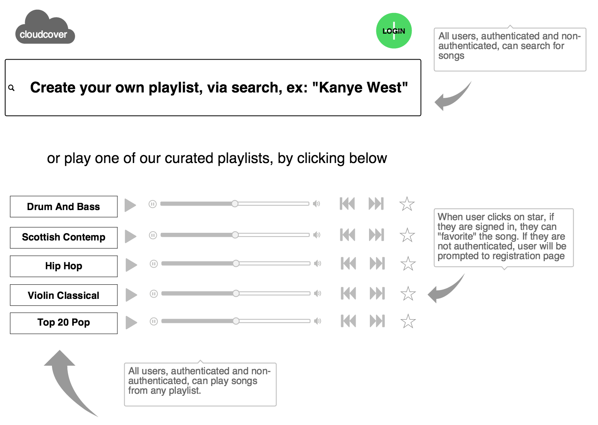
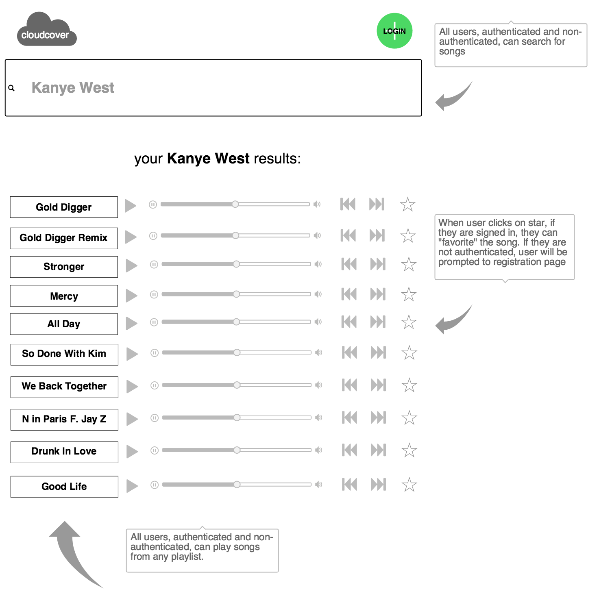
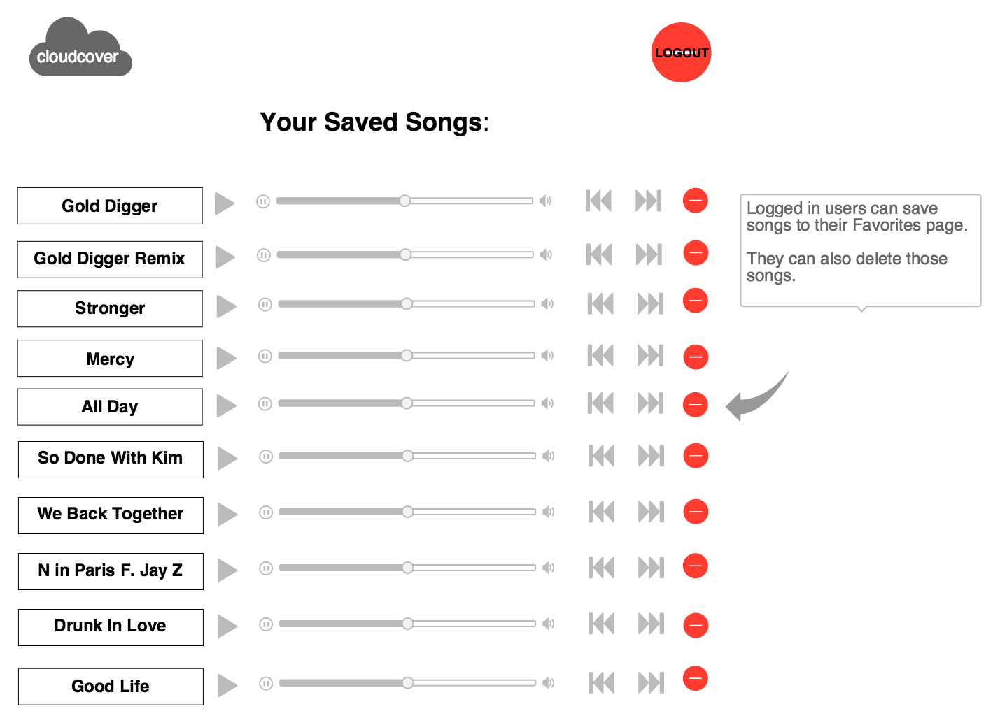

**cloudcover**

This application is a personal music playlist creation device that utilizes the soundcloud.com api.

Specifically, the site it will allow users to:

- Create a feed of songs via soundcloud by entering terms in a simple search box.
- Save favorite songs to a playlist.
- And while not in our MVP, potentially be able to create and manage multiple playlists.

**User Stories**

As a non-authenticated user, I will be able to:

- Create a song feed/queue/radio station by typing a search string and hitting submit, playing the next song once the current song is finished.
- Register as a new user.

As an authenticated user, I will be able to:

- Create a song feed/ queue/ radio station by typing a search string and hitting submit, playing the next song once the current is finished.
- Create a 'smart' radio station, by utlizing soundcloud songs' tags and keywords to search for subsequent songs in a queue. In other words, the app will have an option to curate an evolving playlist for more discoverable content.
- Add individual songs to a favorites/ playlist.
- View all of my favorited songs when I visit my profile page.
- Revisit and play (on-demand) any song that is saved to my playlist at any time, as well as any song that I search for outside of my playlist.
- Delete songs from my list of favorites.

**Technologies**

The application will be built using the Node and Express libraries, HTML, CSS, JavaScript, and Boostrap. We are using Mongo DB as our database, through online solution Modulus.io The app wil be deployed through Heroku.

We are managing team interactions through:

- A team Github repo, with each team member creating their own clone and branches and pushes.
	
	<https://github.com/philuchansky/BPPD>
	
- A Trello board divided into the following sections: Backlog, Assigned, Doing, Awaiting Approval, Approved, and Done.

	<https://trello.com/b/5qqxjYd7/team-project-3-wdi-17>

- A team-specific Slack channel.

**Models**

The application will be comprised of at least 2 models for our MVP. We may include a third model if we decide to incorporate multiple playlists.

**User** 
The User model will include each authenticated member's information:

- username
- email
- location

**Song**  
The Song model will provide details for each song via the soundcloud api. This will include, but not be limited to:

- song name
- artist
- album
- category
- year recorded

**Playlist**  
While not in our MVP, with the addition of this model, users will have the ability to create and manage multiple playlists.

https://moqups.com/petershim61@gmail.com/FGvEPRId

**Wireframes**

Basic wireframes are included.

The first wireframe shows the home page view:

The second wireframe shows the search page results:

The third wireframe shows an authenticated user's individual page, that includes their saved songs:

